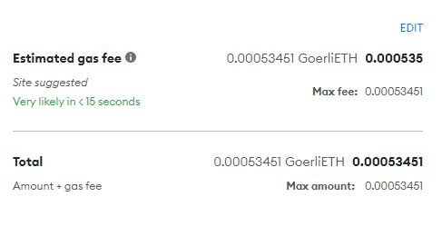

# Smart-Contract1

## Overloading Example

SimpleStorage.sol
```````````````````````
contract SimpleStorage {

  uint256 favoriteNumber;
  
  function store(uint256 _favoriteNumber) public virtual {
     favoriteNumber = _favoriteNumber;
  }
  ...
}
```````````````````````
ExtraStorage.sol
```````````````````````
import "./SimpleStorage.sol";

contract ExtraStorage is SimpleStorage {
    function store(uint256 _favoriteNumber) public override {
        favoriteNumber = _favoriteNumber + 5;
    }
}
```````````````````````

## getPrice.sol
How to get the price of Ethereum (ETH) on the Ethereum network.

### Step 1 
Drop faucet: <a href="https://docs.chain.link/docs/link-token-contracts/#goerli">docs.chain.link#goerli</a> - 
<a href="https://faucetlink.to/goerli">faucetlink.to/goerli</a>

GOERLI TESTNET FAUCET I have registered my address on telegram (0x2C1b8B161F4cE411077D673B3459Fb1564ea0b06) and 
I recived 0.01 goerli faucet from bitszn

### Step 2 
On remix insert code from <a href="https://docs.chain.link/docs/get-the-latest-price/#solidity">doc.chain.link</a>

### Step 3
In Remix select as environment `Iniected Provider - MetaMask` </br>

<i>
``````````````````````````
Gas requirement of function PriceConsumerV3.getLatestPrice is infinite: 
If the gas requirement of a function is higher than the block gas limit, 
it cannot be executed. Please avoid loops in your functions or actions 
that modify large areas of storage
``````````````````````````
</i>


##
[](https://www.linkedin.com/in/roberto-sparacio-b98ab9225/)
